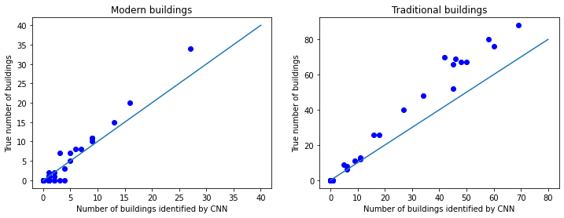

# Background and connection to disease spillover

&nbsp;

This notebook describes the ongoing development of a convolutional neural network (CNN) that identifies village-features in satellite imagery. Though this notebook is intended as a stand-alone example of machine vision, this work is a part of a larger project with the goal of forecasting the risk of disease transmission from wildlife into humans. Oftentimes, these zoonotic viruses occur in areas with limited health infrastructure. As a result, the burden that these viruses cause to humans is underestimated or unknown. It is my hope that machine learning can help pinpoint areas that are most affected by wildlife diseases. If possible, these models can help direct intervention strategies like vaccination.

My current work focuses on Lassa virus, an arenavirus that circulates within rodent populations in West Africa and transmits to humans that come into contact with rodent waste. Generally, a critical step for building better forecasts of a zoonotic virus is obtaining environmental features that predict the abundance of animal reservoirs that are available to host the virus. For example, large-scale GIS datasets, like those provided by the Landsat program, are important for generating broad predictions of where the primary Lassa-reservoir, the multimammate rodent (*Mastomys natalensis*), occurs. However, past field surveys indicated that the distribution of multimammate rats is influenced by small-scale features as well: relative to other rodents that do not transmit Lassa virus,  multimammate rodent populations were more prevalent in village-areas with houses near agricultural cultivations and less prevalent in forested areas of the village. Consequently, CNN's that extract features like houses, cultivations, forest, etc, from imagery, could provide a feature-set that allows for finescale risk prediction. 

I'm proud to state that **this work is my own**. I was responsible for collecting the satellite imagery from a Google API (using QGIS), creating shapefiles that described building perimeter and type, creating annotated versions of images, and of course, designing and fitting the CNN. Obviously, I learned quite a bit from online sources and peer-reviewed articles. These are cited throughout the walkthrough. If the reader is interested in using this repository's datasets, I kindly ask that they give the appropriate credit. 

&nbsp;

# Convolutional neural network design and performance

&nbsp;

As a first step towards the goal of extracting features that are relevant to spillover forecasts, I have created a CNN that identifies buildings in satellite imagery. This CNN is based on the [U-Net image segmentation design](https://link.springer.com/chapter/10.1007%2F978-3-319-24574-4_28), using an [EfficientNet](https://arxiv.org/abs/1905.11946) as an encoder and a simple decoder. Specifically, this CNN will classify each pixel in an image as traditional building (circular thatch structure), modern building (rectangular aluminum roof), or background. The figures below show an example of the CNN's ability to segment the different building types.  

&nbsp;

 &nbsp; &nbsp;&nbsp;&nbsp;&nbsp;&nbsp;&nbsp;&nbsp;&nbsp;&nbsp;&nbsp;&nbsp;&nbsp;&nbsp;&nbsp;&nbsp;

&nbsp;

By segmenting the images in this way, I can then use OpenCV tools to identify groups of pixels as unique buildings. The image below shows the output of a function that I wrote that uses OpenCV the FindContours function. After grouping the building pixels into distinct objects the function overlays the building contours onto the original image.  

&nbsp;

 &nbsp;&nbsp;&nbsp;&nbsp;&nbsp;&nbsp;&nbsp;&nbsp;&nbsp;&nbsp;&nbsp;&nbsp;&nbsp;&nbsp;&nbsp;

&nbsp;

Associating pixel groups with individual pixels, in turn, allows the CNN pipeline to "count" the number of different building types in an image. The plots below show the CNN pipeline's ability to count modern buildings (left) and traditional buildings (right) in test images that were omitted from the training process. Generally, the CNN is able to accurately assess the number of building types in an image -- however, it is also clear that the CNN pipeline underestimates areas with high building density.   
\
&nbsp;

 &nbsp;&nbsp;&nbsp;&nbsp;&nbsp;&nbsp;&nbsp;&nbsp;&nbsp;&nbsp;&nbsp;&nbsp;&nbsp;&nbsp;&nbsp;

&nbsp;

# Jupyter notebooks

&nbsp;

This repository contains the jupyter notebooks, CNN model architectures, and training results of the model-building process. Unfortunately, the full dataset of satellite imagery is too large to upload to Github. As a compromise, I've included two (of 29) large rasters of data that will allow a smaller version of the image dataset to be generated, and a simpler version of the CNN model to be fit. To be clear, the images that are shown above are all from the standard, large-dataset version of the model. 

The original Jupyter notebook is titled "Building_Segmentation.ipynb", and the version of the notebook that uses the truncated dataset is titled "Small_Building_Segmentation.ipynb". Because of the reduced amount of training data, the performance of the small version of the model is significantly worse. Even so, hopefully this helps users of this repository understand how the notebook functions. 

\
&nbsp;
\
&nbsp;
\
&nbsp;
\
&nbsp;

